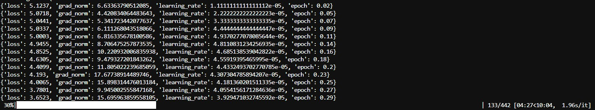
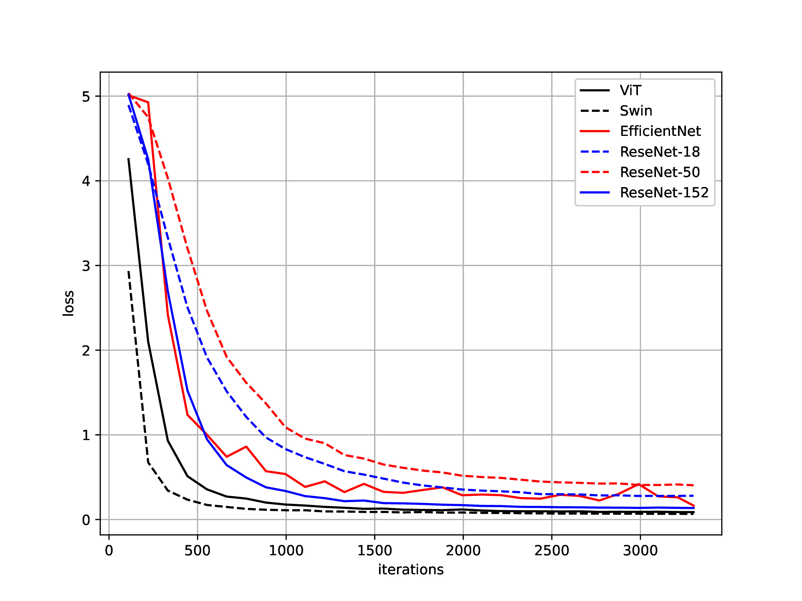

## Introduction
This repository contains all the necessary files to reproduce the results presented in the paper "<b>Robust Tamil Handwritten Character Recognition using Vision Transformers.</b>" Follow the instructions below to set up the environment and run the experiments.

## Set up the environment
 - We recommend using `conda` to set up the Python environment
 - Download the Anaconda distribution specific to your operating system (we used Ubuntu) from [link](https://www.anaconda.com/download/success)
 - Open a terminal and execute the following commands to install Anaconda:
    - `wget https://repo.anaconda.com/archive/Anaconda3-2024.10-1-Linux-x86_64.sh`
    - `bash Anaconda3-2024.10-1-Linux-x86_64.sh` 
 - Clone this repository and navigate to the project directory:
    - `git clone https://github.com/Arunprakash-A/Swin-T-TamilHCR`
    - `cd Swin-T-TamilHCR`
 - Create the environment using `environment.yml`. The default environment name is `.research`, but you can use a different one if needed:
    - `conda env create -f environment.yml`
    - `conda env create -f environment.yml -n env_name`  # Replace <env_name> with a custom name
 - Activate the environment:
    - `conda activate .research` # Replace .research with your chosen environment name

## Downloading the data
 - Run the following script to download the dataset:
    - `python get_data.py` 
    - The dataset will be stored in the `data/train` and `data/test` directories..
    - The training dataset will be in `.arrow` format (cache files can be ignored).

## Training the model
 - To train the model, execute:
    - `python train.py --model swin-t --batch-size 16 --num-train-epochs 1`
 - This will download the tiny version of the Swin Transformer and start training.
 - You can adjust the batch size based on the available GPU memory.
 - To see all available model options, run:
    - `python train.py --help` 
 - During training, loss values will be printed every 10 iterations. You can modify this setting by adjusting the 
   `TrainingArguments` in the `train.py`.
 - 
## Storing the progress
 - Intermediate checkpoints will be saved as  `model-name-finetuned`
 - These checkpoints store essential training states, including optimizer state, learning rate, and model parameters
 - We strongly recommend using experiment tracking platforms such as Weights & Biases (wandb) or Comet for better monitoring and reproducibility.

## Loss curve
 - Batch size: 32
 - Gradient accumulation steps: 4
 - Optimizer: AdamW
 - Precision: Full precision (FP32)
 - 

## Inference
- Download the fine-tuned model weights from [here](https://drive.google.com/file/d/1X303mIpzBnnfT4v5dmya02e-3Qi5ej7X/view?usp=sharing)
- Assuming the test image and the model are in the same directory of the _inference.py_ script
- `python inference.py --image_path test_image.jpg --model_path Swin-Tiny/`
- It outputs the prediction (class id) and the confidence
- `Predicted class ID: 1
     Predicted label: 001
     Confidence: 0.9569`

